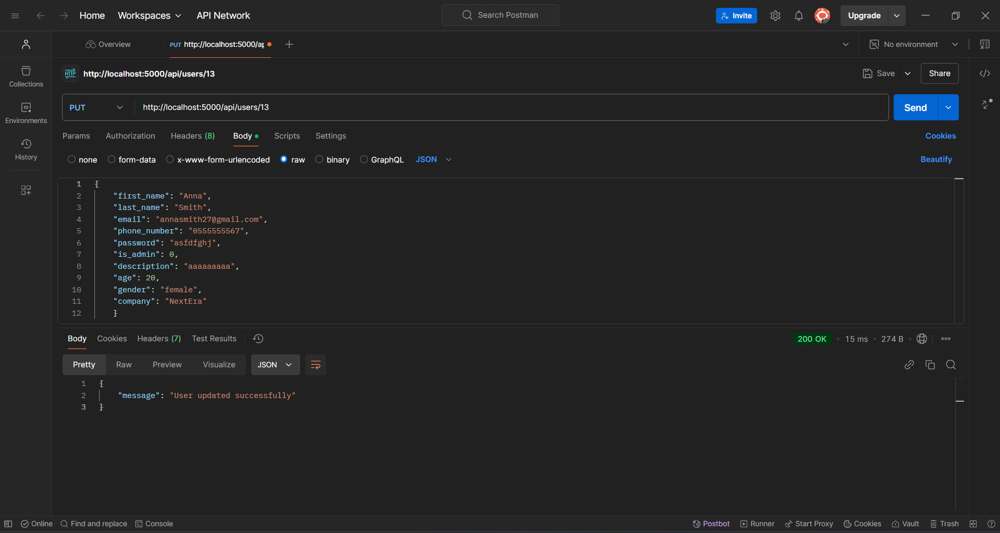

# Тестування працездатності системи

Для перевірки роботи API використовувався інструмент Postman. Нижче представлені зразки запитів та отриманих відповідей для ключових операцій.

---

## **Create**

### Коректне додавання User'а

### Додавання вже існуючого User'а

---

## **Read**

### Зчитування даних усіх User'ів

### Коректне зчитування даних одного User'а

### Зчитування даних одного User'а з неіснуючим ID

---

## **Update**

### Коректне оновлення даних User'а

### Помилка оновлення даних User'а, через вказаний ID в тілі запиту (request body)

