# Тестування працездатності системи

Для перевірки роботи API використовувався інструмент Postman. Нижче представлені зразки запитів та отриманих відповідей для ключових операцій.

---

## **Create**

### Коректне додавання User'а

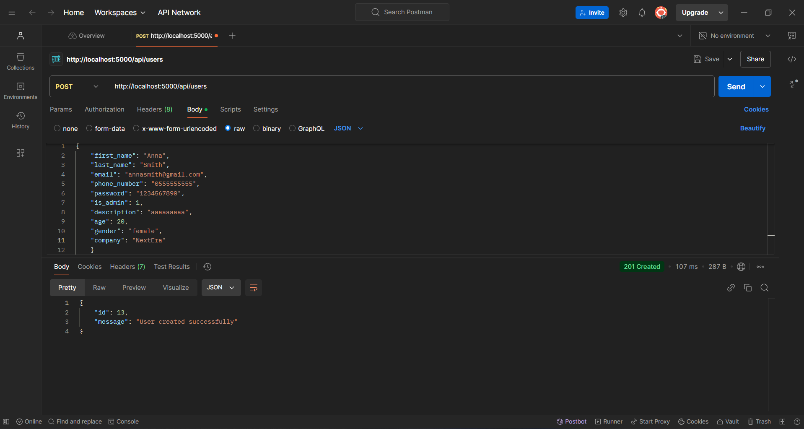

### Додавання вже існуючого User'а

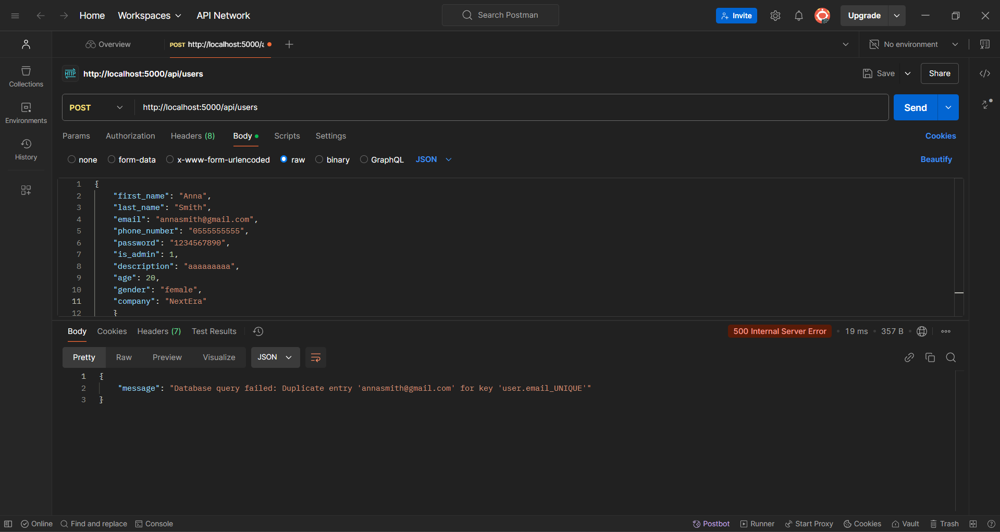

---

## **Read**

### Зчитування даних усіх User'ів

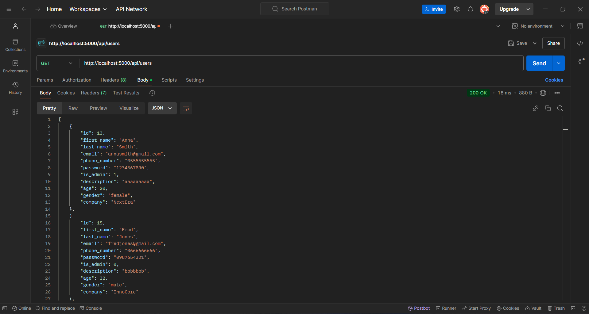

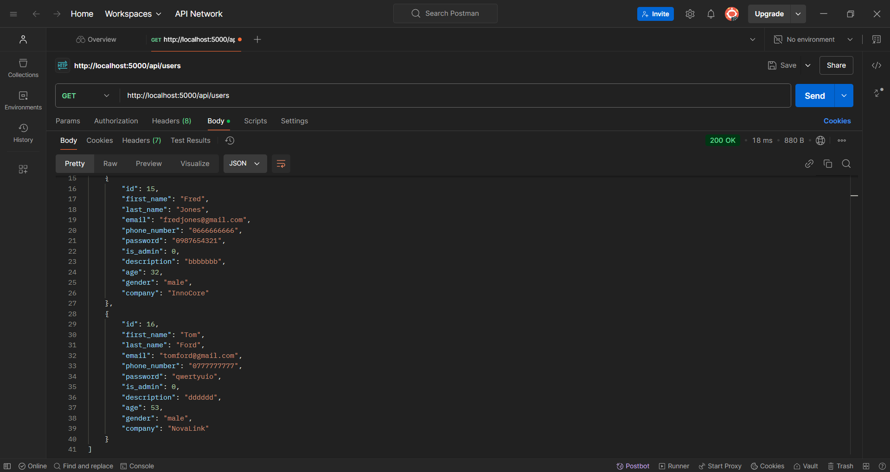

### Коректне зчитування даних одного User'а

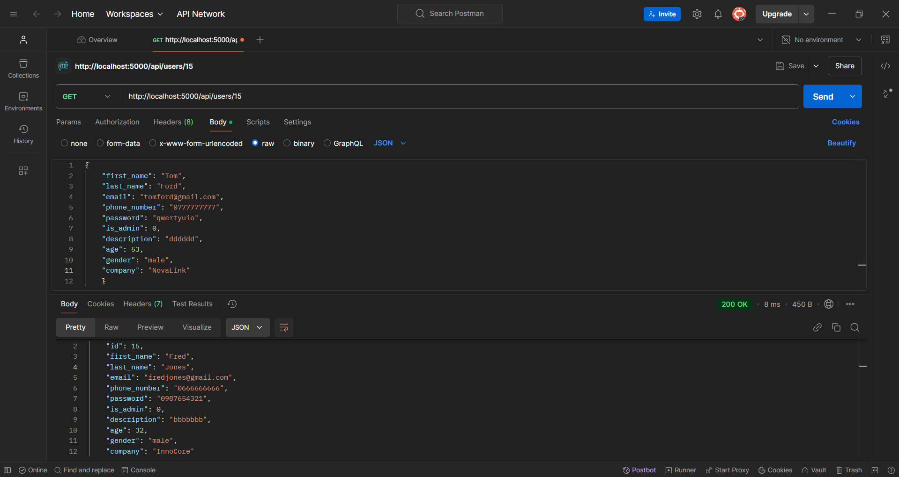

### Зчитування даних одного User'а з неіснуючим ID

---

## **Update**

### До оновлення даних User'а

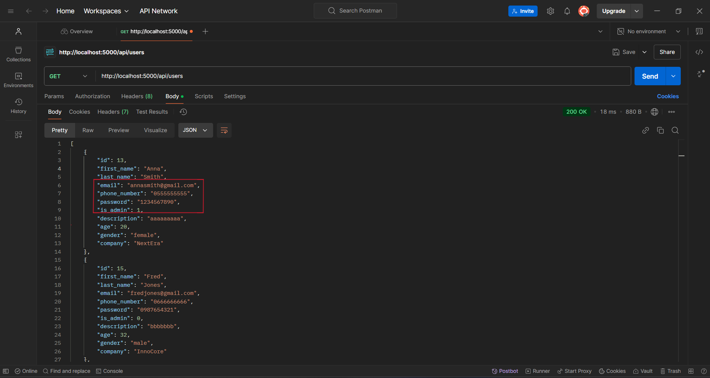

### Коректне оновлення даних User'а

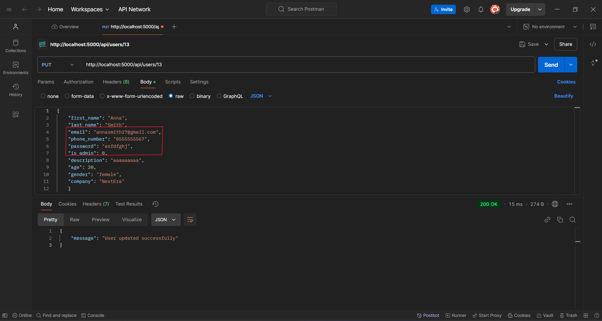

### Після оновлення даних User'а

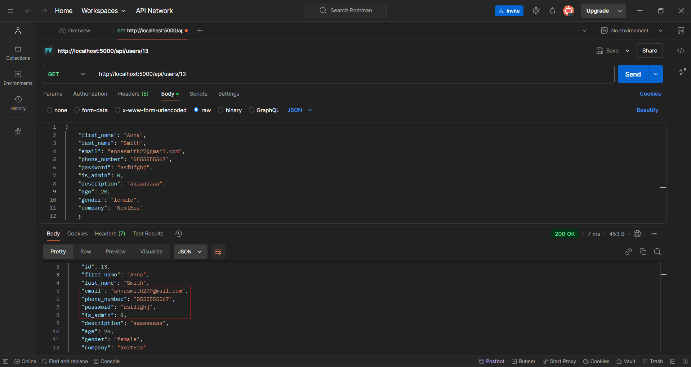

### Помилка оновлення даних User'а, через вказаний ID в тілі запиту (request body)

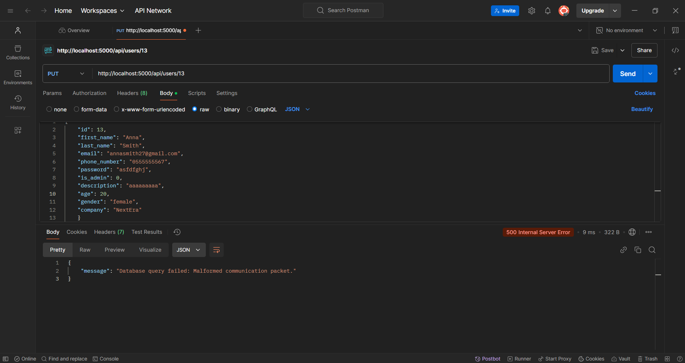

---

## **Delete**

### До видалення

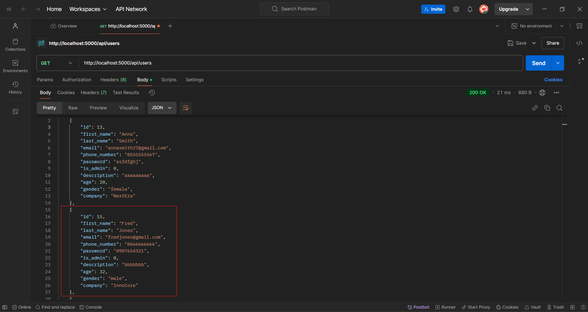

### Коректне видалення даних User'а

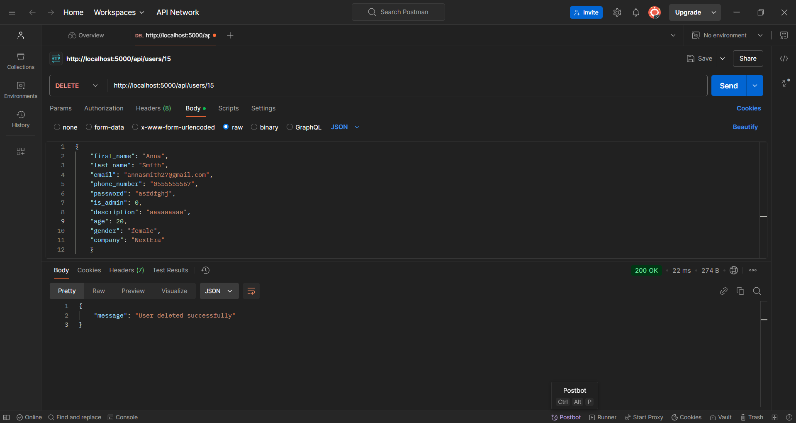

### Після видалення

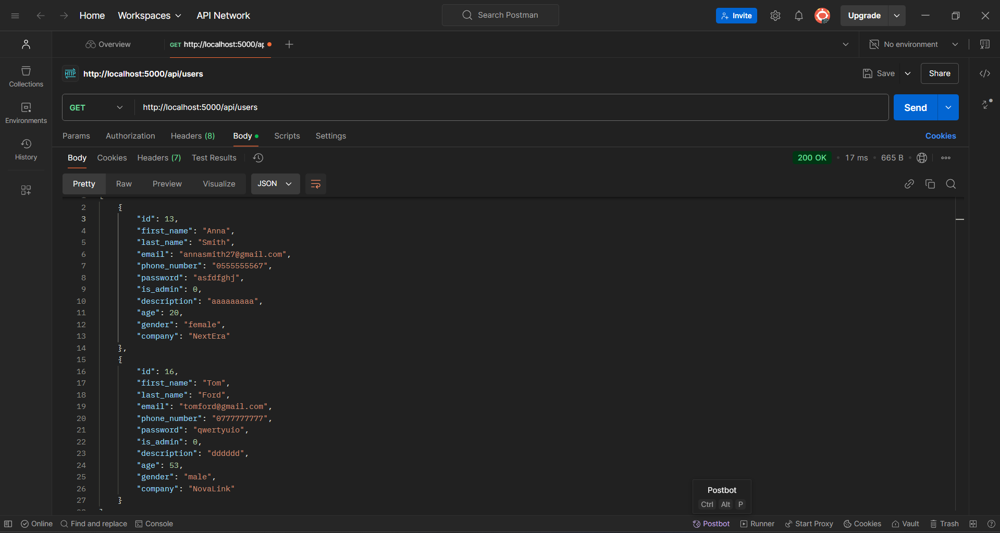

### Помилка видалення даних User'а через відсутність вказаного ID

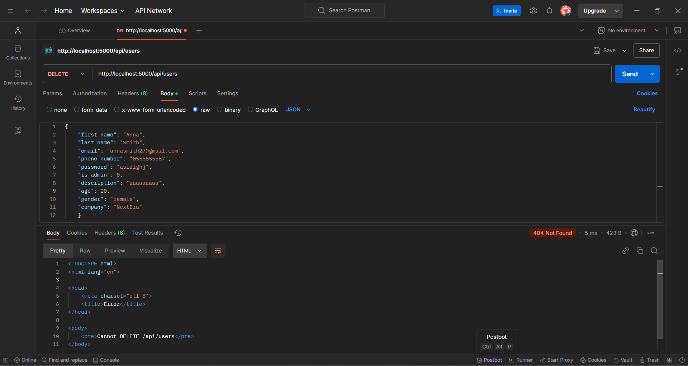

### Помилка видалення даних User'а через неправильно вказаний ID

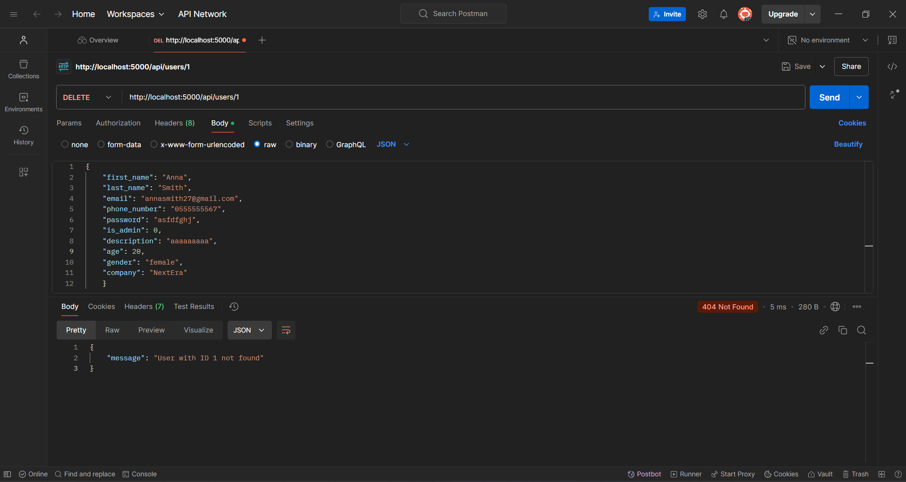